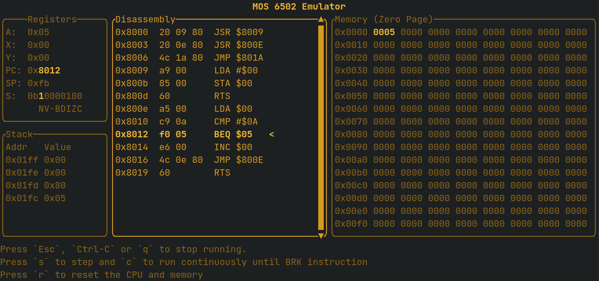

# MOS6502

This is a toy project where I've created an emulator, assembler and a disassembler for the 1975 8-bit MOS 6502 CPU.



## Assembling

### Example program

The assembler supports the syntax found at Nick Morgan's [Easy6502](https://skilldrick.github.io/easy6502/) which looks something like the program below.

Here's a program which increments memory address 0x00 ten times.

```asm
define counter $00  ; Address of counter
define max 10       ; Num of times to loop

main:
  jsr init          ; Initialize counter
  jsr loop          ; Run loop
  jmp exit          ; Exit program

init:
  lda #0            ; Load 0 into accumulator
  sta counter       ; Store accumulator into counter address
  rts

loop:
  lda counter       ; Load what's in counter address into accumulator
  cmp #max          ; Compare accumulator to max value
  beq done          ; If equal, branch to done
  inc counter       ; Increment counter
  jmp loop          ; Jump to loop
done:
  rts               ; Return back to main

exit:
```

To assemble the program into machine code we can run it through the `asm` binary:

```bash
$ cargo run -r --bin asm -- examples/loop.asm
   Compiling mos6502 v0.1.0 (/home/david/Dev/mos6502)
    Finished release [optimized] target(s) in 0.37s
     Running `target/release/asm examples/loop.asm`

8000: 20 09 80 20 0e 80 4c 1a 80 a9 00 85 00 60 a5 00
8010: c9 0a f0 05 e6 00 4c 0e 80 60
```

The program is assembled to a binary (`a.bin`) and its contents are shown.


### Disassembling

The disassembler `disasm` can parse the assembled binary and list the instructions in the program.

```bash
$ cargo run -r --bin disasm -- a.bin
    Finished release [optimized] target(s) in 0.01s
     Running `target/release/disasm a.bin`
 Addr  Hexdump   Instructions
-----------------------------
$8000  20 09 80  JSR $8009
$8003  20 0E 80  JSR $800E
$8006  4C 1A 80  JMP $801A
$8009  A9 00     LDA #$00
$800B  85 00     STA $00
$800D  60        RTS
$800E  A5 00     LDA $00
$8010  C9 0A     CMP #$0A
$8012  F0 05     BEQ $05
$8014  E6 00     INC $00
$8016  4C 0E 80  JMP $800E
$8019  60        RTS
```


### Emulating

To run the assembled program we can invoke the emulator, `emu`. By providing the `--tui` flag a graphical interface is opened (See screenshot up above).

```bash
$ cargo run -r --bin emu -- a.bin --tui
```

If the file passed to `emu` is a file with assembly code, the program will be assembled and run automatically.


## Supported assembler syntax

- Literals (8 bit bytes and 16 bit words)
    - Hex: `$ff`
    - Binary: `%1101`
    - Decimal `42`
- Labels: `main:`
- Constants: `define max $ff`


## Future development

- **Assembler**
    - dot directives
        - `.org $8000`
        - `.byte 42`
        - `.word $8000`
    - `#"A"`
    - Operand arithmetics
- **Emulator**
    - Peripherals - I/O would be fun to have...
    - Decimal mode
    - Stack overflow detection
- **TUI**
    - Load file with `l`
    - Centered disassembler view
- **CLI**
    - Better argparsing


## References

I've found many great resources and project which helped this project, here are a few

- https://skilldrick.github.io/easy6502/
- http://www.6502.org/tutorials/6502opcodes.html
- https://en.wikibooks.org/wiki/6502_Assembly#Load_and_Store
- https://www.masswerk.at/6502/6502_instruction_set.html#LDA
- https://www.nesdev.org/wiki/Nesdev#6502
- https://www.nesdev.org/6502.txt
- https://www.nesdev.org/wiki/6502_cycle_times
- https://github.com/mre/mos6502
- https://en.wikipedia.org/wiki/Interrupts_in_65xx_processors
- http://6502.org/tutorials/interrupts.html
- [Ben Eater's videos](https://www.youtube.com/playlist?list=PLowKtXNTBypFbtuVMUVXNR0z1mu7dp7eH)
- [Javidx9's videos](https://www.youtube.com/playlist?list=PLrOv9FMX8xJHqMvSGB_9G9nZZ_4IgteYf)
