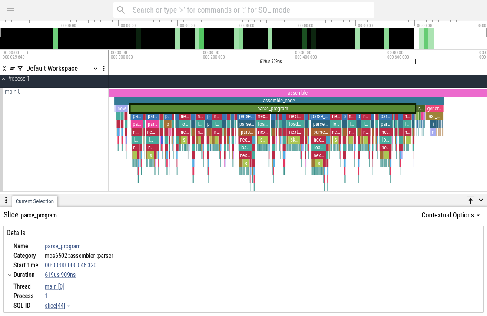

# MOS6502

This is a toy project where I've created an emulator, assembler and a disassembler for the 1975 8-bit MOS 6502 CPU.

[](https://asciinema.org/a/NXcEza2NQAWhok6PgxQD3omvk)

```sh
$ ./mos6502 --help
Usage: mos6502 [OPTIONS] <COMMAND>

Commands:
  assemble     Assemble a program
  disassemble  Disassemble a binary file
  emulate      Run a program in the emulator
  help         Print this message or the help of the given subcommand(s)

Options:
      --trace
          Enable chrome tracing which on program exit will generate
          a json file to be opened with a chrome tracing compatible
          viewer.

  -h, --help
          Print help (see a summary with '-h')

  -V, --version
          Print version
```

## Assembling

### Example program

The assembler supports the syntax found at Nick Morgan's [Easy6502](https://skilldrick.github.io/easy6502/) which looks something like the program below.

Here's a program which increments memory address `0x00` ten times.

```asm
define counter $00  ; Address of counter
define max 10       ; Num of times to loop

.org $8000

main:
  jsr init          ; Initialize counter
  jsr loop          ; Run loop
  jmp exit          ; Exit program

init:
  lda #0            ; Load 0 into accumulator
  sta counter       ; Store accumulator into counter address
  rts

loop:
  lda counter       ; Load what's in counter address into accumulator
  cmp #max          ; Compare accumulator to max value
  beq done          ; If equal, branch to done
  inc counter       ; Increment counter
  jmp loop          ; Jump to loop
done:
  rts               ; Return back to main

exit:
  jmp exit          ; Infinite loop
```

To assemble the program into machine code we can run it through the assembler:

```bash
$ cargo run -r -- assemble examples/loop.asm -o loop.bin
```


## Disassembling

The disassembler can parse the assembled binary and list the instructions in the program.

```bash
$ cargo run -r -- disassemble loop.bin
   Compiling mos6502 v0.1.0 (/home/david/Dev/mos6502)
    Finished release [optimized] target(s) in 0.07s
     Running `target/release/mos6502 disassemble loop.bin`
  Addr  Hexdump   Instructions
------------------------------
0x0000  00        BRK
*
0x8000  20 09 80  JSR $8009
0x8003  20 0e 80  JSR $800e
0x8006  4c 1a 80  JMP $801a
0x8009  a9 00     LDA #$00
0x800b  85 00     STA $00
0x800d  60        RTS
0x800e  a5 00     LDA $00
0x8010  c9 0a     CMP #$0a
0x8012  f0 05     BEQ $05
0x8014  e6 00     INC $00
0x8016  4c 0e 80  JMP $800e
0x8019  60        RTS
0x801a  4c 1a 80  JMP $801a
```


## Emulation

To run the assembled program we can invoke the emulator command.
By default a graphical interface is opened (See screencast up above).

```bash
$ cargo run -r -- emulate loop.bin
```

If the file passed to the emulator is a file with assembly code, the program will be assembled and run automatically.


## Supported assembler syntax

| Syntax type                           | Example                                                       |
|---------------------------------------|---------------------------------------------------------------|
| Instructions (Mnemonic with operands) | `JSR main`, `LDA $00`                                         |
| Comments                              | `; A comment`                                                 |
| Hex literals                          | `$ff`, `$8000`                                                |
| Binary literals                       | `%1101`, `%10110000`                                          |
| Decimal literals                      | `42`, `4096`                                                  |
| Immediate values                      | `#42`, `cmp #max`, `#"A"`                                     |
| Labels                                | `main:`                                                       |
| Constants                             | `define max $ff`, `define screen_width 40`                    |
| Directives                            | `.org $8000`, `.byte $42`, `.word $8000`, `.asci[iz] "Hello"` |


## Future development

- **Assembler**
    - dot directives
        - ~`.org $8000`~
        - ~`.byte 42`~
        - ~`.word $8000`~
        - `.byte 42, $ff`, `.word $8000, $abcd` - Comma separated values
        - ~`.ascii "Hello World"`~
        - ~`.asciz "Hello World"` (Null terminated)~
    - ~`#"A"`~
    - Operand arithmetics
- **Emulator**
    - Peripherals - I/O would be fun to have...
    - Decimal mode
    - Stack overflow detection
- **TUI**
    - Load file with `l`
    - Centered disassembler view
    - Contiuous run with screen update
    - Scrollable stack
    - Disassemble memory if program memory is changed

## Tracing

Tracing can be enabled by passing the `--tracing` flag. Then a [Chrome
Tracing](https://www.chromium.org/developers/how-tos/trace-event-profiling-tool/)
compatible JSON file is created.

```bash
$ cargo run -r -- --trace asm examples/loop.asm
$ ls trace*
trace-1748161187905027.json
```

This tracing file can then be opened with [about:tracing](about:tracing) in the Chrome web browser, or via [Perfetto](https://ui.perfetto.dev/).



## References

I've found many great resources and project which helped this project, here are a few

- https://skilldrick.github.io/easy6502/
- http://www.6502.org/tutorials/6502opcodes.html
- https://en.wikibooks.org/wiki/6502_Assembly#Load_and_Store
- https://www.masswerk.at/6502/6502_instruction_set.html#LDA
- https://www.nesdev.org/wiki/Nesdev#6502
- https://www.nesdev.org/6502.txt
- https://www.nesdev.org/wiki/6502_cycle_times
- https://github.com/mre/mos6502
- https://en.wikipedia.org/wiki/Interrupts_in_65xx_processors
- http://6502.org/tutorials/interrupts.html
- [Ben Eater's videos](https://www.youtube.com/playlist?list=PLowKtXNTBypFbtuVMUVXNR0z1mu7dp7eH)
- [Javidx9's videos](https://www.youtube.com/playlist?list=PLrOv9FMX8xJHqMvSGB_9G9nZZ_4IgteYf)
